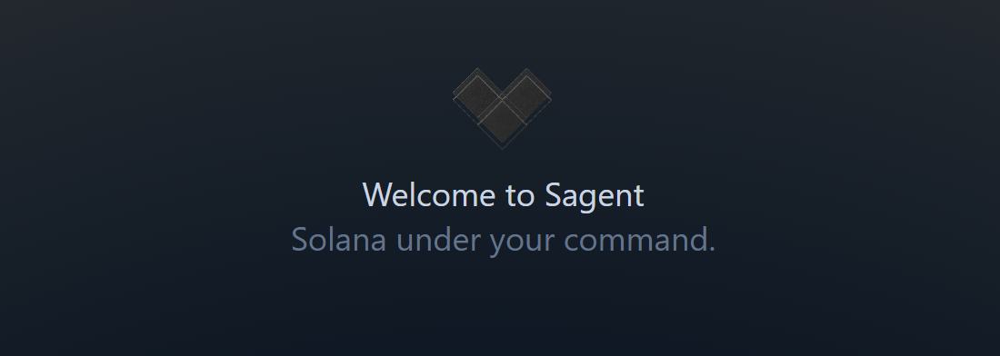
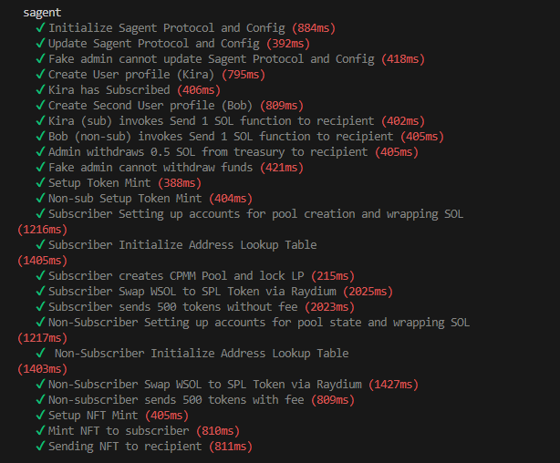
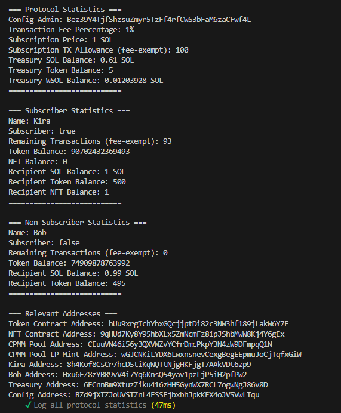

# Sagent - Your Solana On-Chain Assistant



Sagent is your autonomous Solana on-chain assistant that executes commands and provides access to decentralized functionality through a smart contract interface.


## Live Demo

The application is deployed and live at: [Sagent - Solana Agent](https://sagent.vercel.app/)

Program ID on Devnet: SAGEfgw3ncJAvhqBadJ8B377AvPEJ5wGw6jtgGKFueG

## Project Description

Sagent is a powerful on-chain assistant that enables:
- Command execution directly on Solana blockchain
- Integration with Raydium protocols for DeFi operations
- Token metadata management and manipulation
- Smart contract interactions through a unified interface
- Extensible architecture for custom functionality

## Technologies Used

- **Solana Blockchain**: For decentralized and fast transactions
- **Anchor Framework**: For writing and deploying Solana smart contracts
- **Raydium Integration**: For DeFi operations and liquidity management
- **Token Metadata Program**: For NFT and token management
- **Solana Scaffold**: For initial template of the Next.js front-end
- **OpenAI API**: For advanced natural language processing and command interpretation
- **Langchain**: For AI-powered command processing and natural language understanding
- **Solana Wallet Adapter**: For seamless wallet integration and transaction signing

## Prerequisites

Ensure you have the following installed:

- **Rust**: `rustc 1.79.0`
- **Solana CLI**: `solana-cli 1.18.18`
- **Anchor CLI**: `anchor-cli 0.30.1`
- **Node.js**: `v20.10.0`
- **npm**: `10.2.3`

## Building and Testing Locally

Follow these steps to build and test the Sagent program:

1. **Clone the Repository**
   ```bash
   git clone https://github.com/solana-turbin3/Q1_25_Builder_karimnasereddin/tree/main/capstone/sagent
   ```

2. **Navigate to the Project Directory**
   ```bash
   cd sagent
   ```

3. **Install Dependencies**
   ```bash
   npm install
   ```

4. **Build the Program**
   ```bash
   anchor build
   ```

5. **Run Tests**
   ```bash
   anchor test
   ```

## Project Structure

```
sagent/
├── programs/          # Sagent program implementation
│   └── sagent/       # Core program logic
├── tests/            # Program test suite
├── migrations/       # Deployment scripts
├── Anchor.toml       # Anchor configuration
└── Cargo.toml        # Rust dependencies
```

## Dependencies

The project relies on several key dependencies:
```toml
anchor-lang = "0.30.1"
anchor-spl = "0.30.1"
mpl-token-metadata = "5.1.0"
raydium-cpmm-cpi = { git = "https://github.com/raydium-io/raydium-cpi", branch = "anchor-0.30.1" }
raydium-locking-cpi = { git = "https://github.com/raydium-io/raydium-cpi", branch = "anchor-0.30.1" }
```

## Config State Class Diagram


## User Profile State Class Diagram


## Instructions Diagram


## Test Results

When running `anchor test`, you should see successful test execution similar to the screenshots below (26 Passing):

### Test Execution


*Screenshot showing the test suite running with all tests passing*

### Test Coverage


*Screenshot showing test coverage metrics*


